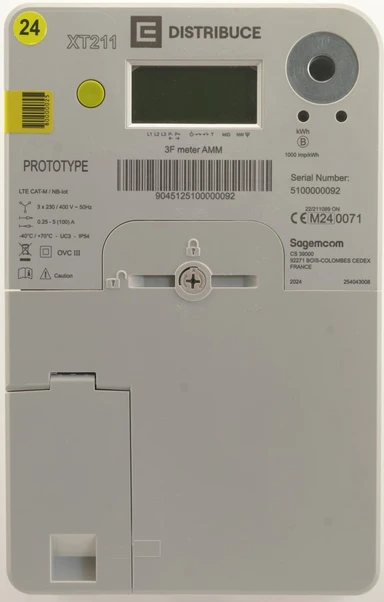
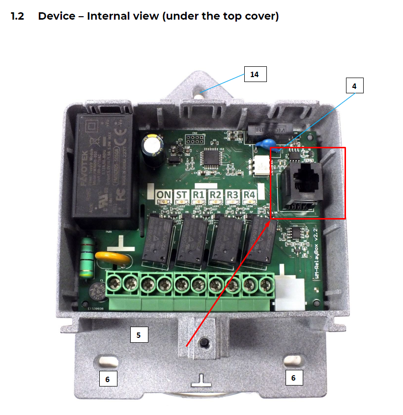
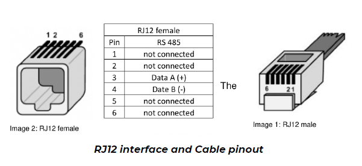
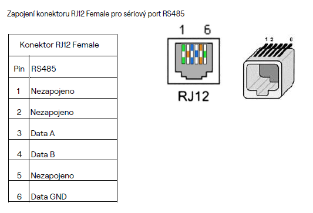
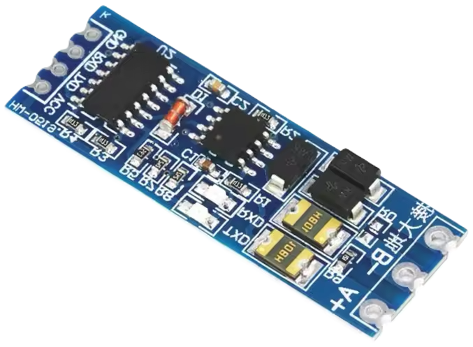
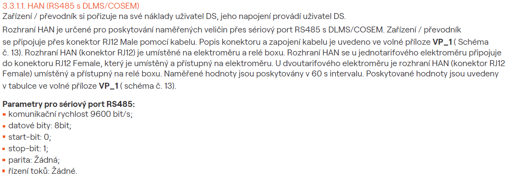
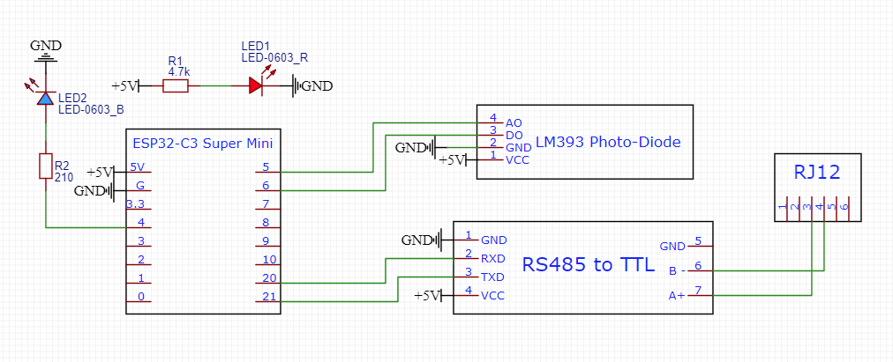

# ESPHome DLMS/Cosem PUSH RS485 čtení
### [[English Version]](README.md)

Můj poskytovatel elektřiny (ČEZ Distribuce) mi právě nainstaloval nový chytrý elektroměr. Až do teď jsem používal [Home Assistant Glow](https://glow-energy.io/) pro sledování spotřeby domácnosti. Takže jsem byl nadšený, že se konečně dostanu k novému elektroměru a zkusím z něj číst data. Bohužel to nebylo tak jednoduché, jak jsem doufal, ale po mnoha neúspěšných pokusech se mi to povedlo rozchodit a chci se s vámi podělit o zkušenosti.

## Sagecom XT211 - Můj elektroměr

[Stránky ČEZ Distribuce pro Sagecom XT211 AMM](https://www.cezdistribuce.cz/pro-zakazniky/potrebuji-vyresit/elektromery-a-odecty/pruvodce-elektromery/xt211-amm) | [Datasheet](documents/Datasheet_Sagemcom_XT211_EN.pdf)



Sagecom XT211 je třífázový chytrý elektroměr podporující protokol DLMS/COSEM pro datovou komunikaci. Má integrované RS485 rozhraní, které lze použít pro čtení dat. Elektroměr je nastavený na PUSH komunikaci, což znamená, že každých 60 sekund sám odesílá data bez nutnosti dotazování.


V mém případě byl port elektroměru připojen do zařízení WM-RelayBox, které slouží k dálkovému odpojování dodávky elektřiny. Rozhraní RS485 je přístupné přes RJ12 port na zařízení.


### WM-RelayBox

[Datasheet](documents/WM-RelayBox__Datasheet_2024-ENG_v3.pdf) | [Installation Guide](documents/WM-Relay_Box__Installation_Guide_EN_V3_1.pdf) | [Quick Guide](documents/WM-RelayBox__Quick_Guide_V1_00.pdf)

RelayBox se připojuje k elektroměru (přes jeho RJ12 E-Meter port) a přijímá jednosměrné DLMS/COSEM PUSH zprávy a příkazy z Head-end systému prostřednictvím elektroměru.

Potom provádí požadované akce relé a zároveň odesílá všechna data z elektroměru do zákaznického rozhraní HAN / P1 (oddělený, galvanicky izolovaný RJ12 port).



### Zákaznické rozhraní HAN

HAN port je izolovaný RJ12 port poskytující přístup k datům odesílaným elektroměrem. Port využívá RS485 komunikaci s následujícím zapojením:




Některé zdroje uvádí, že pin 6 je připojen k zemi, jiné že se nepoužívá. Já mám připojené jen piny 3 a 4, protože pro RS485 potřebuji jen datové vodiče (a měl jsem jen RJ11 kabel bez pinů 1 a 6).

| Pin | Signal      |
|-----|-------------|
| 1   | Not used    |
| 2   | Not used    |
| 3   | Data A (+)  |
| 4   | Data B (-)  |
| 5   | Not used    |
| 6   | GND         |

### RS485 na TTL převodník

Pro připojení HAN portu do ESPHome zařízení jsem použil RS485 na TTL převodník. Konkrétně tento modul z AliExpressu [ TTL To RS485](https://www.aliexpress.com/item/1005006828879851.html?spm=a2g0o.order_list.order_list_main.458.667a1802FPpBbB), ale existuje mnoho podobných.



### Parametry RS485

Parametry jsou definované v dokumentu [připojovací podmínky NN](documents/pripojovacipodminkynn.pdf) od ČEZ Distribuce:



| Parameter       | Hodnota  |
|-----------------|----------|
| Baud rate       | 9600 bps |
| Data bits       | 8        |
| Start bits      | 0        |
| Stop bits       | 1        |
| Parity          | None     |
| Flow control    | None     |

## PulseMeter (Home Assistant Glow)

Na [Home Assistant Glow](https://glow-energy.io/) jsem měl rád že se hodnoty aktualizovaly celkem rychle (podle frekvence pulzů). Nový elektroměr však posílá PUSH zprávy jen každých 60 sekund, což není ideální pro sledování okamžité spotřeby.

Takže jsem to zkombinoval: PulseMeter používám pro okamžitý příkon (W) a DLMS/Cosem z ESPHome pro energii (kWh).

Více o PulseMeteru najdeš v dokumentaci [Home Assistant Glow documentation](https://glow-energy.io/).

### LM393 Fotodiodový senzor


# Montáž

ESPHome zařízení a RS485 převodník jsem dal do malé projektové krabičky.

### [Box.stl](3d%20print/Box.stl)


Krabičku pro fotodiodu jsem převzal z Home Assistant Glow.

### [Sensor_bottom_side_v1.stl](3d%20print/Sensor_bottom_side_v1.stl)


### [Sensor_top_side_v1.stl](3d%20print/Sensor_top_side_v1.stl)


Vyrobil jsem rám pro upevnění senzoru na elektroměr XT211.

### [Frame XT211 Wide.stl](3d%20print/Frame%20XT211%20Wide.stl)


# Schéma zapojení



LM393 fotodioda:
- VCC → 5V
- GND → GND
- DO (Digitální výstup) → GPIO6
- AO (Analogový výstup) → GPIO5 (analogový vstup, volitelné)

RS485 na TTL převodník:
- VCC → 5V
- GND → GND
- TXD → RX (GPIO21)
- RXD → TX (GPIO22)

HAN port (RJ12 / RJ11):
- B- (Data B) → HAN pin 4
- A+ (Data A) → HAN pin 3
- GND → pin 6 (volitelné)

Activity LED (volitelné):
- Anoda → GPIO4 (+ 220 ohmový rezistor)
- Katoda → GND

Power Led (volitelné):
- Anoda → 5V (+ 4700 ohmový rezistor - pro nižší jas)
- Katoda → GND

# Custom ESPHome komponenta

Pro čtení PUSH zpráv DLMS/Cosem z XT211 jsem upravil existující projekt [esphome-dlms-cosem](https://github.com/latonita/esphome-dlms-cosem).

Odstranil jsem polling, opravil pár chyb a přidal podporu pro binární senzory.

Více detailů v projektu [esphome-dlms-cosem repository](https://github.com/latonita/esphome-dlms-cosem) od [latonita](https://github.com/latonita)

## ESPHome konfigurace

### Kompletní konfigurace: [esphome-smartmeter.yaml](esphome-smartmeter.yaml)

```yaml
esp32:
  variant: esp32c3
  framework:
    type: esp-idf
```

Přidej externí komponentu:

```yaml
external_components:
  - source: github://Tomer27cz/xt211
    components: [xt211]
    refresh: 1s
```
Poté nastav DLMS/Cosem komponentu:
- push_show_log: true (volitelné, bude zobrazovat surové PUSH zprávy v logu pro debug a testování)

Až to bude fungovat, logy vypni.

```yaml
uart:
  id: bus_1
  tx_pin: GPIO20
  rx_pin: GPIO21
  baud_rate: 9600
  data_bits: 8
  parity: NONE
  stop_bits: 1

xt211:
  push_show_log: true
```

### Number sensor (`sensor`)
Moje spotřeba elektřiny se měří v kWh, ale elektroměr odesílá hodnotu ve Wh. Proto používám lambda filtr k převodu hodnoty z Wh na kWh vydělením 1000.

```yaml
sensor:
  - platform: xt211
    id: active_energy_consumed
    name: "Energy"
    obis_code: 1.0.1.8.0.255
    unit_of_measurement: kWh
    accuracy_decimals: 3
    device_class: energy
    state_class: total_increasing
    filters:
      - lambda: "return x/1000.0;"
```

### Binary sensor (`binary_sensor`)
Binární senzor má hodnotu `false`, pokud je hodnota 0, a hodnotu `true`, pokud je hodnota jakákoli jiná.

```yaml
binary_sensor:
  - platform: xt211
    name: "Relay 1"
    obis_code: 0.1.96.3.10.255
```

### Text sensor (`text_sensor`)

```yaml
text_sensor:
  - platform: xt211
    name: "Serial number"
    obis_code: 0.0.96.1.1.255
    entity_category: diagnostic
```

### Pulzní měřič (`pulse_meter`) - pro monitorování spotřeby energie (W) v reálném čase

```yaml
time:
  - platform: homeassistant
    id: homeassistant_time

number:
  - platform: template
    id: select_pulse_rate
    name: 'Puls rate - imp/kWh'
    optimistic: true
    mode: box
    min_value: 100
    max_value: 10000
    step: 100
    restore_value: yes
    initial_value: 1000

sensor:
  - platform: pulse_meter
    name: 'Pulse Power Consumption'
    id: sensor_energy_pulse_meter
    unit_of_measurement: 'W'
    state_class: measurement
    device_class: power
    icon: mdi:flash-outline
    accuracy_decimals: 0
    pin: GPIO6

    on_raw_value: 
      then:
        - switch.turn_on: indicator_led
        - delay: 100ms
        - switch.turn_off: indicator_led  
    on_value:
      then:
        - sensor.template.publish:
            id: power_consumption
            state: !lambda 'return x;'
    
    # dont know what this does but it was commented out
    internal_filter: 100ms
    
    filters:
      # Sensor can quickly transition between on and off (unintendet bevaior)
      # this meter has max load of 13.27 kW (32A - 3 Phase - 240V) = pulse every 270ms at full load
      - debounce: 100ms
      # multiply value = (60 / imp value) * 1000
      # - multiply: 60
      # Clamp to physically possible max (13.3 kW) - if larger then drop the value
      - lambda: |-
          float watts = x * ((60.0 / id(select_pulse_rate).state) * 1000.0);
          if (watts > 13300.0) return NAN;
          return watts;

      # Update the sensor with an average every 10th second. See
      # https://github.com/klaasnicolaas/home-assistant-glow/#reduce-the-amount-of-data-the-sensors-produce
      # for more information.
      #- throttle_average: 10s
      
      # filter out impossible numbers
      - filter_out: NaN
```

### Kombinace spotřeby energie ze senzorů PulseMeter a DLMS/Cosem

Vytvoříme senzor `template`, který kombinuje spotřebu energie ze senzorů PulseMeter a DLMS/Cosem. Pokaždé, když se kterýkoli ze senzorů aktualizuje, aktualizuje se i kombinovaný senzor.

```yaml
sensor:
  - platform: template
    id: power_consumption
    name: "Power Consumption"
    unit_of_measurement: 'W'
    accuracy_decimals: 0
    device_class: power
    state_class: measurement
    icon: mdi:flash

  [... pulzní měřič z výše uvedeného configu ...]
  
  - platform: xt211
    id: active_power
    name: "Active power consumption"
    obis_code: 1.0.1.7.0.255
    unit_of_measurement: W
    accuracy_decimals: 0
    device_class: power
    state_class: measurement
    on_value:
      then:
        - sensor.template.publish:
            id: power_consumption
            state: !lambda 'return x;'
```

## OBIS kódy ČEZ Distribuce XT211

Úplný seznam OBIS kódů naleznete v dokumentu [vp_1-13.pdf](documents/vp_1-13.pdf) od ČEZ Distribuce.

| OBIS kód        | Hodnota         | Popis                                 |
|-----------------|-----------------|---------------------------------------|
| 0-0:96.1.1.255  | SN meter        | Výrobní číslo elektroměru (Device ID) |
| 0-0:96.3.10.255 | stav odpojovače | Indikace stavu odpojovače             |
| 0-0:17.0.0.255  | limiter         | Hodnota pro limiter                   |
| 0-1:96.3.10.255 | stav relé R1    | Stav relé R1                          |
| 0-2:96.3.10.255 | stav relé R2    | Stav relé R2                          |
| 0-3:96.3.10.255 | stav relé R3    | Stav relé R3                          |
| 0-4:96.3.10.255 | stav relé R4    | Stav relé R4                          |
| 0-0:96.14.0.255 | aktuální tarif  | Aktuální tarif                        |
| 1-0:1.7.0.255   | P+              | Okamžitý činný výkon odběru           |
| 1-0:21.7.0.255  | P+ L1           | Okamžitý činný výkon v L1             |
| 1-0:41.7.0.255  | P+ L2           | Okamžitý činný výkon v L2             |
| 1-0:61.7.0.255  | P+ L3           | Okamžitý činný výkon v L3             |
| 1-0:2.7.0.255   | P-              | Okamžitý činný výkon dodávky          |
| 1-0:22.7.0.255  | P- L1           | Okamžitý činný výkon v L1             |
| 1-0:42.7.0.255  | P- L2           | Okamžitý činný výkon v L2             |
| 1-0:62.7.0.255  | P- L3           | Okamžitý činný výkon v L3             |
| 1-0:1.8.0.255   | A+              | Činná energie (+A)                    |
| 1-0:1.8.1.255   | A+ T1           | Činná energie tarif 1 (+A)            |
| 1-0:1.8.2.255   | A+ T2           | Činná energie tarif 2 (+A)            |
| 1-0:1.8.3.255   | A+ T3           | Činná energie tarif 3 (+A)            |
| 1-0:1.8.4.255   | A+ T4           | Činná energie tarif 4 (+A)            |
| 1-0:2.8.0.255   | A-              | Činná energie (-A)                    |


# Finální setup

Finální konfigurační soubor ESPHome naleznete zde: [esphome-smartmeter.yaml](esphome-smartmeter.yaml)


Finální setup má:
- Zařízení ESPHome s komponentou DLMS/Cosem 
- Převodník RS485 na TTL 
- Fotodiodový senzor LM393 pro PulseMeter 
- Namontované uvnitř projektové krabičky 
- Připojené k HAN portu WM-RelayBoxu 
- Připojené k Home Assistant přes integraci ESPHome 
- Activity LED pro indikaci detekce pulzu 
- Power LED pro indikaci stavu napájení 
- Napájení přes 5V napájecí zdroj (z USB napájecího adaptéru)

## Poděkování
- [latonita](https://github.com/latonita) - za původní komponentu esphome-dlms-cosem

