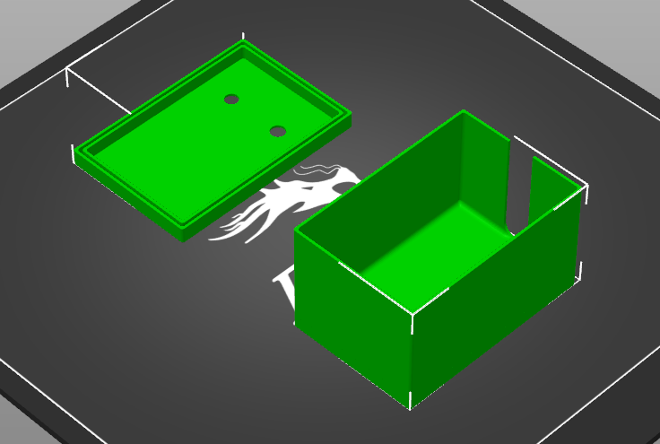
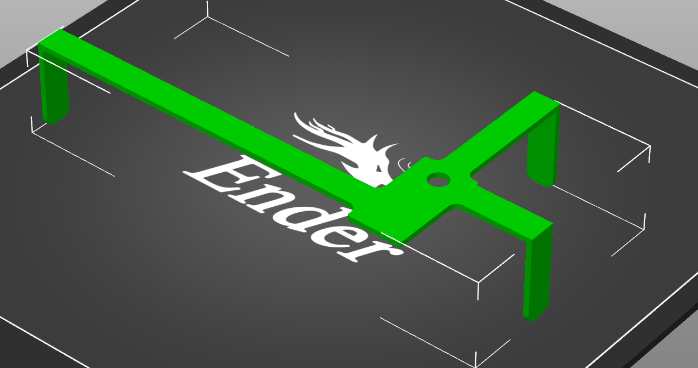

# ESPHome DLMS/Cosem PUSH RS485 readout
### For Sagecom XT211 smart meter used by ČEZ Distribuce (Czechia)
### [[Česká verze]](README.cz.md)

My electricity provider (ČEZ Distribuce) has just installed a new smart meter at my home. Up until this time I was using the [Home Assistant Glow](https://glow-energy.io/) to track my household energy consumption. So I was excited to finnaly get my hands on the new smart meter and see if I can read out the data from it. Unfortunately it was not as easy as I hoped, but after many failed attempts I managed to get it working, and I want to share my experience with you.

## Sagecom XT211 - My smart meter

[Distribution company website (in czech)](https://www.cezdistribuce.cz/pro-zakazniky/potrebuji-vyresit/elektromery-a-odecty/pruvodce-elektromery/xt211-amm) | [Datasheet](documents/Datasheet_Sagemcom_XT211_EN.pdf)


The Sagecom XT211 is a three-phase smart meter that supports DLMS/COSEM protocol for data communication. It has a built-in RS485 interface that can be used to read out the meter data. The meter is configured for PUSH communication, which means it sends data every 60 seconds without the need for polling.


In my case, the meters port was connected to the WM-RelayBox device, which is used for remote disconnection of the electricity supply. The RS485 interface is accessible via an RJ12 port that is located on the device.


### WM-RelayBox 

[Datasheet](documents/WM-RelayBox__Datasheet_2024-ENG_v3.pdf) | [Installation Guide](documents/WM-Relay_Box__Installation_Guide_EN_V3_1.pdf) | [Quick Guide](documents/WM-RelayBox__Quick_Guide_V1_00.pdf)

The RelayBox connects to the electricity meter (via its RJ12 E-Meter interface) and it receives unidirectional (one-way) DLMS / COSEM „push” commands and messages from the Head-end System through the meter.

Then it executes the relay switch requests and sends all data provided by the smart meter to the Customer Interface HAN / P1 output interface (separate, isolated RJ12 port) of the RelayBox.


### HAN port

The HAN port is an isolated RJ12 port that provides access to the data sent by the electricity meter. The port uses RS485 communication with the following pinout:


Some sources say that the 6th pin is connected to GND, while others say it is not used. I only have pins 3 and 4 connected, because I only need the data lines for RS485 communication (and I only had an RJ11 telephone cable that does not have pins 1 and 6).

| Pin | Signal      |
|-----|-------------|
| 1   | Not used    |
| 2   | Not used    |
| 3   | Data A (+)  |
| 4   | Data B (-)  |
| 5   | Not used    |
| 6   | GND         |

### RS485 to TTL converter

To connect the HAN port to my ESPHome device, I used a RS485 to TTL converter. I used this AliExpress [ TTL To RS485](https://www.aliexpress.com/item/1005006828879851.html?spm=a2g0o.order_list.order_list_main.458.667a1802FPpBbB) module, but there are many other similar modules available.


### RS485 parameters

The RS485 communication parameters are defined in [připojovací podmínky NN](documents/pripojovacipodminkynn.pdf) document provided by ČEZ Distribuce:


| Parameter       | Value    |
|-----------------|----------|
| Baud rate       | 9600 bps |
| Data bits       | 8        |
| Start bits      | 0        |
| Stop bits       | 1        |
| Parity          | None     |
| Flow control    | None     |

## PulseMeter (Home Assistant Glow)

One thing I liked about the [Home Assistant Glow](https://glow-energy.io/) meter was that it updated fairly quickly (depending on the pulse frequency). The new meter sends PUSH messages only every 60 seconds, which is not ideal for real-time monitoring. 

So I decided to get the best of both worlds and use the PulseMeter in Home Assistant for real-time power consumption (W) monitoring, while using the ESPHome DLMS/Cosem readout for the energy (kWh) monitoring.

For more information about the PulseMeter, see the [Home Assistant Glow documentation](https://glow-energy.io/).

### LM393 Photo-diode sensor


# Mounting

I mounted the ESPHome device and the RS485 to TTL converter inside a small project box.

### [Box.stl](3d print/Box.stl)


I took the photodiode sensor box from the Home Assistant Glow meter.

### [Sensor_bottom_side_v1.stl](3d print/Sensor_bottom_side_v1.stl)


### [Sensor_top_side_v1.stl](3d print/Sensor_top_side_v1.stl)


I made a Frame for mounting the sensor box on the XT211 meter.

### [Frame XT211 Wide.stl](3d print/Frame XT211 Wide.stl)


# Wiring diagram


LM393 Photo-diode sensor:
- VCC to 5V
- GND to GND
- DO (Digital Output) to GPIO6
- AO (Analog Output) to GPIO5 (analog input, optional)

RS485 to TTL converter:
- VCC to 5V
- GND to GND
- TXD to RX (GPIO21)
- RXD to TX (GPIO22)

HAN port (RJ12 / RJ11):
- B- (Data B) to HAN port pin 4
- A+ (Data A) to HAN port pin 3
- GND to pin 6 (optional)

Activity LED (optional):
- Anode (longer leg) to GPIO4 (with 220 ohm resistor in series)
- Cathode (shorter leg) to GND

Power Led (optional):
- Anode (longer leg) to 5V (with 4700 ohm resistor in series - lower brightness)
- Cathode (shorter leg) to GND

# Custom ESPHome component 

To read out the DLMS/Cosem PUSH messages from the Sagecom XT211 meter, I modified the existing [esphome-dlms-cosem](https://github.com/latonita/esphome-dlms-cosem).

Removed the polling functionality, fixed some bugs, and added support for binary sensors.

For a more detailed description of the component, see the [esphome-dlms-cosem repository](https://github.com/latonita/esphome-dlms-cosem) from [latonita](https://github.com/latonita)

## ESPHome configuration

### For full configuration file, see: [esphome-smartmeter.yaml](esphome-smartmeter.yaml)

Add the external component to your ESPHome configuration:

```yaml

external_components:
  - source: github://Tomer27cz/xt211
    components: [xt211]
```
Then configure the DLMS/Cosem component:
- push_show_log: true (optional, for debugging purposes - shows all received PUSH messages in the log)

Disable the log onece everything is working fine.

```yaml
uart:
  id: bus_1
  tx_pin: GPIO20
  rx_pin: GPIO21
  baud_rate: 9600
  data_bits: 8
  parity: NONE
  stop_bits: 1

xt211:
  push_show_log: true
```

### Number sensor (`sensor`)
My electricity consumption is measured in kWh, but the meter sends the value in Wh. Therefore, I use a lambda filter to convert the value from Wh to kWh by dividing it by 1000.

```yaml
sensor:
  - platform: xt211
    id: active_energy_consumed
    name: "Energy"
    obis_code: 1.0.1.8.0.255
    unit_of_measurement: kWh
    accuracy_decimals: 3
    device_class: energy
    state_class: total_increasing
    filters:
      - lambda: "return x/1000.0;"
```

### Binary sensor (`binary_sensor`)
The binary sensor is `false` when the value is 0, and `true` when the value is anything else.

```yaml
binary_sensor:
  - platform: xt211
    name: "Relay 1"
    obis_code: 0.1.96.3.10.255
```

### Text sensor (`text_sensor`)
The text sensor is used to display string values sent by the meter.

```yaml
text_sensor:
  - platform: xt211
    name: "Serial number"
    obis_code: 0.0.96.1.1.255
    entity_category: diagnostic
```

### Pulse meter (`pulse_meter`) - for real-time power consumption monitoring (W)

```yaml
time:
  - platform: homeassistant
    id: homeassistant_time

number:
  - platform: template
    id: select_pulse_rate
    name: 'Puls rate - imp/kWh'
    optimistic: true
    mode: box
    min_value: 100
    max_value: 10000
    step: 100
    restore_value: yes
    initial_value: 1000

sensor:
  - platform: pulse_meter
    name: 'Pulse Power Consumption'
    id: sensor_energy_pulse_meter
    unit_of_measurement: 'W'
    state_class: measurement
    device_class: power
    icon: mdi:flash-outline
    accuracy_decimals: 0
    pin: GPIO6

    on_raw_value: 
      then:
        - switch.turn_on: indicator_led
        - delay: 100ms
        - switch.turn_off: indicator_led  
    on_value:
      then:
        - sensor.template.publish:
            id: power_consumption
            state: !lambda 'return x;'
    
    # dont know what this does but it was commented out
    internal_filter: 100ms
    
    filters:
      # Sensor can quickly transition between on and off (unintendet bevaior)
      # this meter has max load of 13.27 kW (32A - 3 Phase - 240V) = pulse every 270ms at full load
      - debounce: 100ms
      # multiply value = (60 / imp value) * 1000
      # - multiply: 60
      # Clamp to physically possible max (13.3 kW) - if larger then drop the value
      - lambda: |-
          float watts = x * ((60.0 / id(select_pulse_rate).state) * 1000.0);
          if (watts > 13300.0) return NAN;
          return watts;

      # Update the sensor with an average every 10th second. See
      # https://github.com/klaasnicolaas/home-assistant-glow/#reduce-the-amount-of-data-the-sensors-produce
      # for more information.
      #- throttle_average: 10s
      
      # filter out impossible numbers
      - filter_out: NaN
```

### Combine power consumption from PulseMeter and DLMS/Cosem sensors

We create a template sensor that combines the power consumption from the PulseMeter and DLMS/Cosem sensors. Every time any of the sensors update, they also update the combined sensor.

```yaml
sensor:
  - platform: template
    id: power_consumption
    name: "Power Consumption"
    unit_of_measurement: 'W'
    accuracy_decimals: 0
    device_class: power
    state_class: measurement
    icon: mdi:flash
  
  [... pulse meter from above ...]
  
  - platform: xt211
    id: active_power
    name: "Active power consumption"
    obis_code: 1.0.1.7.0.255
    unit_of_measurement: W
    accuracy_decimals: 0
    device_class: power
    state_class: measurement
    on_value:
      then:
        - sensor.template.publish:
            id: power_consumption
            state: !lambda 'return x;'
```

## ČEZ Distribuce XT211 OBIS codes

You can find the full list of OBIS codes in the [vp_1-13.pdf](documents/vp_1-13.pdf) document provided by ČEZ Distribuce.

| OBIS Code       | Value           | Description                           |
|-----------------|-----------------|---------------------------------------|
| 0-0:96.1.1.255  | SN meter        | Výrobní číslo elektroměru (Device ID) |
| 0-0:96.3.10.255 | stav odpojovače | Indikace stavu odpojovače             |
| 0-0:17.0.0.255  | limiter         | Hodnota pro limiter                   |
| 0-1:96.3.10.255 | stav relé R1    | Stav relé R1                          |
| 0-2:96.3.10.255 | stav relé R2    | Stav relé R2                          |
| 0-3:96.3.10.255 | stav relé R3    | Stav relé R3                          |
| 0-4:96.3.10.255 | stav relé R4    | Stav relé R4                          |
| 0-0:96.14.0.255 | aktuální tarif  | Aktuální tarif                        |
| 1-0:1.7.0.255   | P+              | Okamžitý činný výkon odběru           |
| 1-0:21.7.0.255  | P+ L1           | Okamžitý činný výkon v L1             |
| 1-0:41.7.0.255  | P+ L2           | Okamžitý činný výkon v L2             |
| 1-0:61.7.0.255  | P+ L3           | Okamžitý činný výkon v L3             |
| 1-0:2.7.0.255   | P-              | Okamžitý činný výkon dodávky          |
| 1-0:22.7.0.255  | P- L1           | Okamžitý činný výkon v L1             |
| 1-0:42.7.0.255  | P- L2           | Okamžitý činný výkon v L2             |
| 1-0:62.7.0.255  | P- L3           | Okamžitý činný výkon v L3             |
| 1-0:1.8.0.255   | A+              | Činná energie (+A)                    |
| 1-0:1.8.1.255   | A+ T1           | Činná energie tarif 1 (+A)            |
| 1-0:1.8.2.255   | A+ T2           | Činná energie tarif 2 (+A)            |
| 1-0:1.8.3.255   | A+ T3           | Činná energie tarif 3 (+A)            |
| 1-0:1.8.4.255   | A+ T4           | Činná energie tarif 4 (+A)            |
| 1-0:2.8.0.255   | A-              | Činná energie (-A)                    |


# Final setup

The final esphome configuration file can be found here: [esphome-smartmeter.yaml](esphome-smartmeter.yaml)


The final setup includes:
- ESPHome device with DLMS/Cosem component
- RS485 to TTL converter
- LM393 Photo-diode sensor for PulseMeter
- Mounted inside a project box
- Connected to the HAN port of the WM-RelayBox
- Connected to Home Assistant via ESPHome integration
- Activity LED to indicate pulse detection
- Power LED to indicate power status
- Powered via 5V power supply (from USB power adapter)

## Credits
- [latonita](https://github.com/latonita) - for the original esphome-dlms-cosem component

